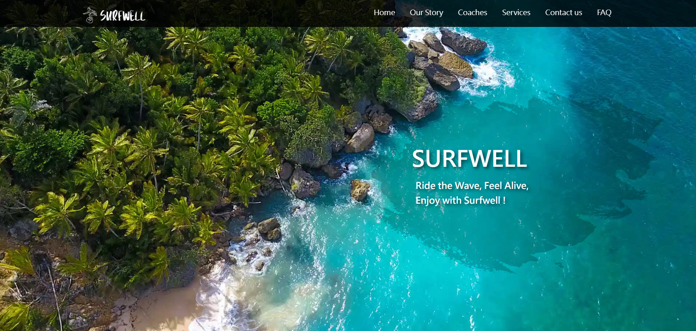
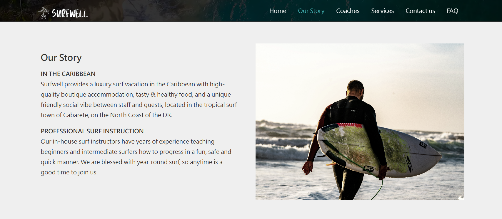
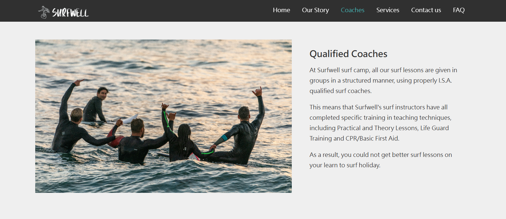
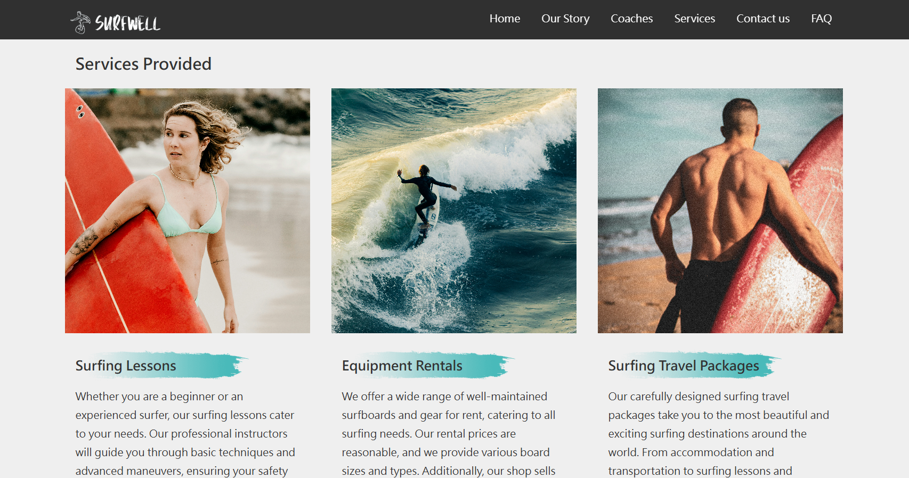
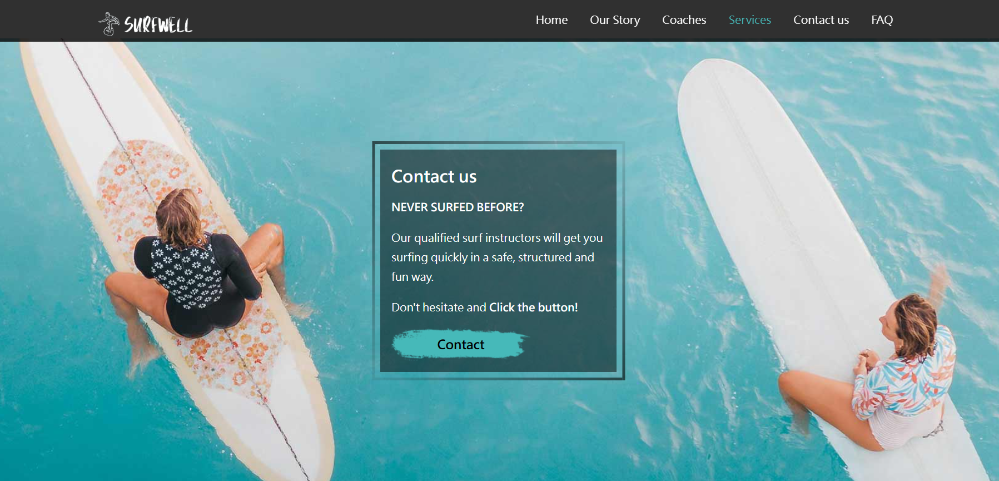
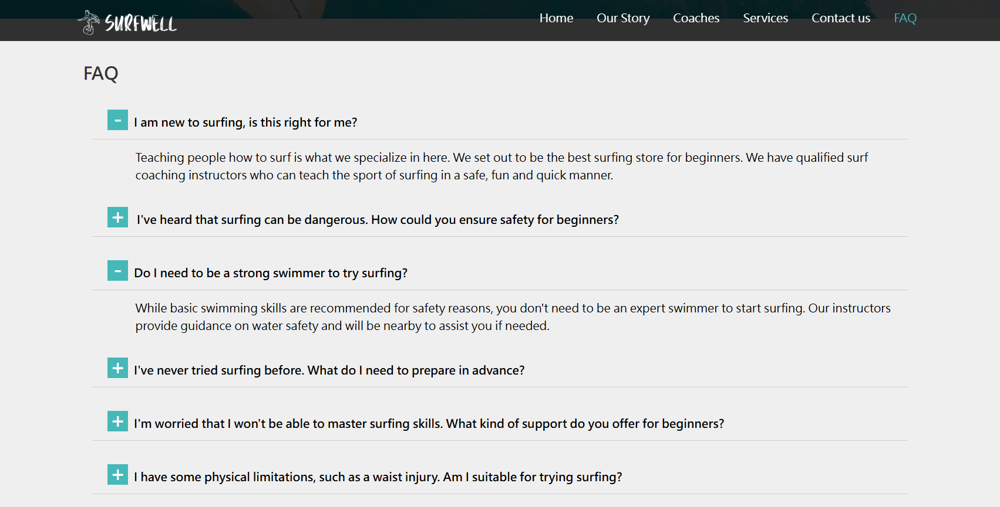
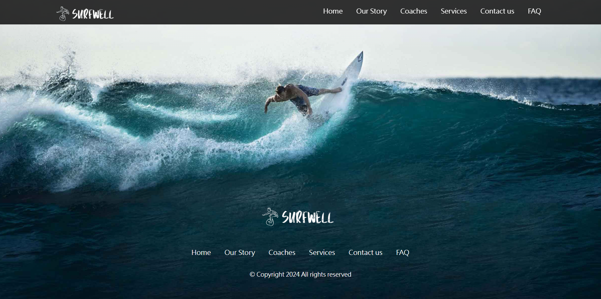

# 🏄 Surfwell - A Surf-Themed RWD Webpage


## 🏝️ Overview
**Surfwell** is a surf-themed webpage that captures the spirit of the ocean, showcasing surfing services, coaches, and tropical vibes. 
Built purely with **HTML5** and **CSS3** to demonstrate clean design and responsive layout skills. 
Every wave-inspired design choice—vibrant colors, bold typography, and curated imagery—reflects a passion for surfing and pixel-perfect craftsmanship. 
Perfect for surf enthusiasts and recruiters looking for front-end talent!🌊

## 🌐 Live Demo
[👉 Visit Surfwell on GitHub Pages](https://marcus7k7k7k.github.io/Surfwell)

## 🧩 Built with
 


---
## 🚀 How to Run the Project

### Using `live-server`:
1. Install `live-server` (if not installed):
   ```bash
   npm install -g live-server

2. Start the server:
   ```bash
   live-server

3. Open http://127.0.0.1:8080 in your browser.


---
## ✨ Key features
Introduces a luxury surf retreat in Cabarete, highlighting tropical vibes, pro coaching, and year-round waves.



Showcases professional surfing coaches and their unique styles, sparking your passion for the waves



Presents surfing lessons, equipment rentals, and global travel packages for wave riders of all levels.



Invites beginners to connect for fun, safe surf lessons with a bold call-to-action button.



Answers common questions about surfing, from safety to skills, with an easy-to-read Q&A.



Wraps up the site with quick navigation links and a chill vibe design.



## 📌 Future Plans
- Enable JavaScript-powered interactivity for the contact form and FAQ accordion.
- Explore form submission options via Google Forms or backend integration.
- Optimize performance and responsiveness, especially for mobile devices.
- Implement multilingual support (e.g. English/Mandarin switcher).
- ...and more!

---
## 👤 Author
- **Marcus**  
  - GitHub: [marcus7k7k7k](https://github.com/marcus7k7k7k)  

## 🔒 License
Copyright Notice and Statement: currently not offering any license. Permission only to view and download.